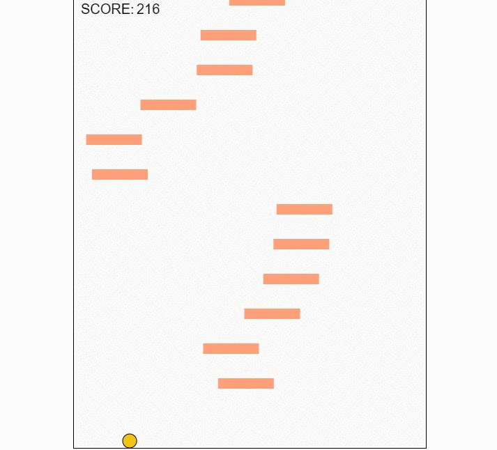

# Doodle_Jump

A Doodle Jump Game with Html5 and Canvas

##Features
This game uses html5 and canvas api to create a doodle-jump like game . It makes use of the keyboard arrow keys to control the ball.

##Implementation
In index.js, all logic for creating and moving the ball and platform block is held .
It contains logic for : 
* Randomly creating new reachable, yet dispersed blocks
* Shift in platform blocks to keep the ball in view
* Tracking the score

##Technology
 
 *HTML5
 *Canvas API
 *CSS

